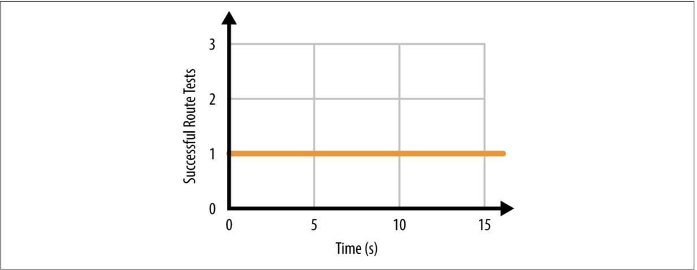
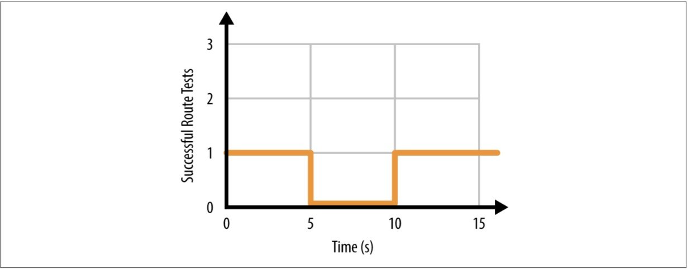
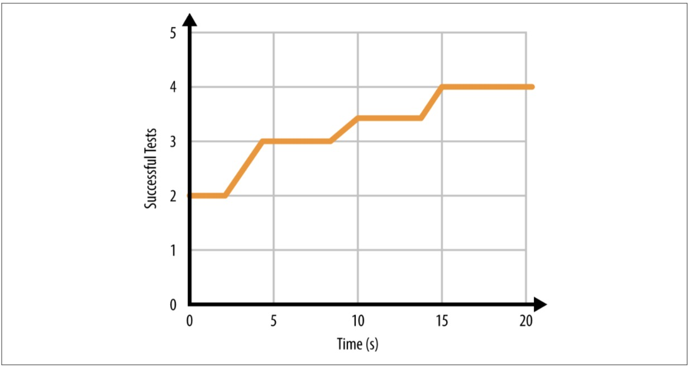
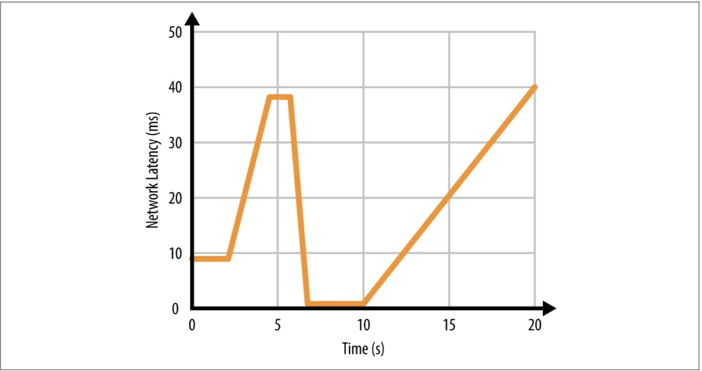

# 第6章 测试云原生基础架构

基础架构支持应用程序。能够信任软件对于工程成功至关重要。如果每次在终端输入ls命令，都会发生随机动作？你永远不会相信ls，并会找到一种不同的方式来列出目录中的文件。

我们需要能够信任我们的基础设施。本章旨在开放信任和验证基础设施的意识形态。我们将描述的实践旨在增加对应用程序和工程师基础设施的信心。

测试软件的实践在当今的软件工程领域非常普遍。然而，测试基础设施的做法实际上是不确定的。

这意味着在本书中的所有课程中，这应该是最令人兴奋的！像你这样的工程师有空间在这个空间中发挥出色的影响力。

测试软件是一种证明某些工作有效的做法，它不会失败，并且这些条件在各种边缘情况下仍然存在。因此，如果我们将相同的范例应用于测试基础架构，我们的测试目标如下：

1. 按预期证明基础设施工程。
2. 证明基础设施不失败。
3. 证明这两种情况在各种边缘情况下都是正确的。

衡量基础设施是否有效需要我们先定义什么工作方式。现在，您应该对代表基础架构和工程应用程序来管理代表的想法感到满意。

定义基础架构API的用户应该花时间专注于创建一个可以创建工作基础架构的理智的API。例如，拥有一个定义虚拟机的API并且没有网络信息来运行它们是愚蠢的。您应该在API中创建有用的抽象，然后使用第3章和第4章中提出的想法来确保API创建正确的基础结构组

我们已经开始开发一个心智模型，通过定义API来对我们基础设施的健全性进行检查。这意味着我们可以翻转逻辑并想象出相反的情况，这将是除了原始心智模型中的东西之外的所有东西。

为基础设施定义基本的完整性测试的做法是值得的努力。因此测试基础设施的第一步是证明您的基础设施是按照预期存在的，并且没有任何东西存在与原意相反。

在本章中，我们将探索基础设施测试，并为世界新的测试工具顺序奠定基础。

## 我们测试了什么？

在我们开始编写一行代码之前，我们必须首先确定需要测试的问题。

测试驱动开发是测试第一位的常见做法。这些测试是为了证明测试的关注而编写的，并且在第一天就会隐含失败。开发周期旨在使测试通过;也就是说，该软件是为满足每个测试中定义的要求而开发的。这是一个强大的实践，可以帮助软件保持专注，并帮助工程师对他们的软件以及测试结果产生信心。

这是一个可以以多种方式回答的哲学问题。对我们需要证明真实而非虚假的想法有一个好的想法对于建立值得信赖的基础设施是必不可少的。例如，如果存在依赖基础设施的业务问题，则应该对其进行测试。更重要的是，许多企业不仅依赖基础设施，还会在出现问题时自行修复。

确定您的基础架构需要填充的问题空间代表了需要编写的第一轮测试。

规划未来是基础设施测试的另一个重要方面，但应该谨慎。有足够的前瞻性和过度工程之间有一条细线。如果有疑问，坚持最少量的测试逻辑。

在我们完全了解我们需要用我们的测试进行演示之后，我们可以考虑实施测试套件。

## 编写可测试代码

协调模式的规则不仅旨在创建一个干净的基础设施应用程序，而且还旨在鼓励可测试的基础设施代码。

这意味着，在我们应用程序的每一个重要步骤中，我们总是会重新创建一个相同类型的新对象，这意味着我们基础系统的每个主要组件都会说相同的输入和输出。使用相同的输入和输出可以更轻松地以编程方式测试软件的小型组件。测试将确保您的组件按预期工作。

然而，在编写基础设施测试代码时，还有许多其他有价值的经验值得借鉴。我们将在假设情景下看看测试基础架构的具体示例。在我们浏览场景时，您将了解测试基础架构代码的经验教训。

我们还会提出一些工程师在开始编写可测试基础架构代码时可以遵守的规则。

### 验证

采用非常基础的基础结构定义，如示例6-1。

例6-1. infrastructure.json

```json
{
    "virtualMachines": [{
        "name": "my-vm",
        "size": "large",
        "localIp": "192.168.1.111",
        "subnet": "my-subnet"
    }],
    "subnets": [{
        "name": "my-subnet",
        "cidr": "10.0.100.0/24"
    }]
}
```

数据的目标应该是显而易见的：确保一个名为my-vm的虚拟机的大小为任意大小，IP地址为192.168.1.111。这些数据也暗示确保一个名为my-subnet的子网将容纳虚拟机my-vm。

希望你抓住这个数据有什么问题。虚拟机的IP地址超出了子网的可用CIDR范围。

针对应用程序运行此特定数据应该会导致失败，因为虚拟机在网络上将无效。如果我们的应用程序的构建是为了盲目地允许部署任何数据，我们将创建可联网的基础架构。尽管我们应该编写测试以确保新的虚拟机能够在网络上进行路由，但我们还可以做其他事情来帮助强化我们的应用程序并使测试更加轻松。

在我们的应用程序处理输入的想法之前，我们可以首先尝试验证输入。这在软件工程中是很常见的做法。

想象一下，如果不是盲目部署这个基础设施，我们首先试图验证输入。在运行时，我们的应用程序可以轻松检测到虚拟机的IP地址在虚拟机所连接的子网中不起作用。这将阻止输入到达我们的基础设施环境。由于知道应用程序将故意拒绝无效的基础架构表示，我们可以编写令人高兴和悲伤的测试来确保实现此行为。

快乐测试是一种测试，可以对条件进行正面处理。换句话说，它是一种向应用程序发送有效API对象并确保应用程序接受有效输入的测试。虐待狂是一种测试，可以对相反的情况或情况的负面情况进行分析。例6-1是一个悲伤测试的例子，它将一个无效的API对象发送给应用程序，并确保应用程序拒绝无效输入。

这种新模式使测试基础架构非常快速，而且通常不贵。一位工程师可以开始开发大量快乐和悲伤测试，即使是最奇怪的应用程序输入也是如此。此外，测试集合可以随着时间的推移而增长;在冒名顶替者API对象流入环境的不幸场景中，工程师可以快速添加测试以防止再次发生。

输入验证是测试最基本的事情之一。通过在我们的应用程序中编写简单的验证来检查理智的值，我们可以开始滤除我们程序的输入。这也给我们一个很容易定义有意义的错误并快速返回错误的途径。

验证提供信心，而不会让您等待基础设施发生变异。这为面向API开发的工程师创建了更快的反馈循环。

### 输入您的代码库

我们继续照顾自己并编写易于测试的代码非常重要。一个容易出错的问题可能会导致成本上升，因此需要围绕专有输入设计应用程序。专有输入是仅与程序中的一个点相关的输入，获得所需输入的唯一方法是线性执行程序。以这种方式线性编写代码对于人类大脑来说是有意义的，但它是有效测试的最难的模式之一，特别是当涉及到测试基础架构时。

专有输入陷入困境的例子如下：

1. 函数DoSomething()的调用返回Something {}。
2. Something {}传递给函数NextStep（Something）并返回SomethingElse {}。
3. SomethingElse {}被传递给函数FinalStep（其他），返回true或false。

这里的问题是，为了测试FinalStep()函数，我们首先需要遍历步骤1和2.在测试的情况下，这会引入复杂性和更多的失败点;它甚至可能不会在测试执行的环境中工作。

更优雅的解决方案是以这样一种方式构造代码，即可以在程序的其余部分使用相同的数据结构上调用最后一步()：

1. 代码初始化GreatSomething {}，它实现了方法great.DoSomething()。
2. GreatSomething {}实现该方法很棒的东西。NextStep()。
3. GreatSomething {}实现了很棒的方法.FinalStep()。

从测试的角度来看，我们可以为我们希望测试的任何步骤填充GreatSomething {}，并相应地调用这些方法。这个例子中的方法现在负责处理它们扩展的对象中定义的内存。这与最后一种方法不同，在这种方法中，特殊的内存中结构被传递到每个函数中。

这是一个更加优雅的设计，因为测试工程师可以轻松地为任何步骤合成存储器，并且只需要关注学习同一数据的一个表示。这是更加模块化的，如果它们很快被发现，我们可以回到任何故障。

当您开始编写构成您的应用程序的软件时，请记住，在传统运行时间线期间，您需要在许多点上跳转到代码库。构建你的代码以便于在任何时候轻松地输入代码库，因此在内部测试系统至关重要。在这样的情况下，你可以成为你自己最好的朋友或最大的敌人。

## 自我意识

>告诉我你如何衡量我，我会告诉你我将如何表现。
>
>——Eliyahu M. Goldratt

在编写代码和编写测试时注意自己的置信度。自我意识是软件工程中最重要的部分之一，并且常常是最容易被忽视的部分之一。

测试的最终目标是增加对应用程序的信心。在基础设施领域，我们的目标是增强我们的信心，即我们的基础设施完成我们希望的目标。

据说，测试基础架构没有正确或错误的方法。它很容易被代码覆盖或单元测试等应用程序中的每个函数所困扰。但是这些会引入错误的信心

代码覆盖率是以程序化方式衡量您的代码库正在被测试执行的行为。这个度量标准可以用作原始数据点，但了解即使是覆盖率达到100％的代码库仍然可能会出现极端中断，这一点至关重要。

如果你通过代码覆盖来测试你的测试，那么工程师将编写更容易被测试覆盖的代码，而不是更适合于该任务的代码。丹Ariely在他的文章“以你为衡量标准” “对于哈佛商业评论：

人类根据他们所面对的指标调整行为。您衡量的任何内容都会促使某个人在该指标上优化他的分数。你测量的是你会得到的。期。

我们应该衡量的唯一指标是我们的信心，即我们的基础设施按预期工作，并且我们可以证明这一点。

测量信心几乎是不可能的。但是有些方法可以让工程师从心理和情绪空间中抽取有意义的数据集。

通过问自己以下问题，我们可以在超时记录我们的答案：

 - 我担心这是行不通的吗？
 - 我可以肯定，这将做我认为会做的事吗？
 - 如果有人更改此文件，会发生什么情况？

从有意见的问题中提取数据的最强大技术之一是比较以前经验的水平。例如，一位工程师可以做出如下陈述，而团队的其他成员很快就会明白他们想要传达的内容：

我比上周刚刚发布的这个代码更令人担忧。

现在，根据团队以前的经验，我们可以开始为我们的信心水平制定一个规模，其中规模的0端是一个团队实际上没有信心的经历，而规模的上限是他们的时间感到非常自信。正如我们理解什么让我们担心我们的应用一样，了解需要测试以增加信心的内容很简单。

## 测试类型

了解测试的类型以及测试的使用方式将有助于工程师增加其基础架构应用程序的信心。这些测试不需要编写，而且没有正确或错误的方法来使用它们。唯一的问题是我们相信我们的应用程序要做我们想做的事情。

### 基础结构断言

在软件工程中，一个强大的概念是断言，这是一种强制的方式 - 完全确定条件是否成立。有许多成功的框架已经开发出来，它们使用断言来测试软件。断言是一个微小的函数，它将测试条件是否为真。这些功能可以在各种测试场景中使用，以证明概念正在发挥作用，并有望引入信心。

在本章的其余部分中，我们将提到基础结构断言。您需要对这些断言的内容以及他们希望完成的内容有基本的了解。您还需要对Go编程语言有基本的了解，才能充分认识这些断言正在做什么。

在基础设施领域需要声明我们的基础设施有效。构建这些断言功能的库对于您的项目来说是一个值得的练习。开源社区也可以从这个工具包中测试基础架构中受益。

例6-2显示了Go编程语言中的断言模式。假设我们想测试虚拟机是否可以解析公共主机名，然后路由到它们。

例6-2. assertNetwork.go

```go
type VirtualMachine struct { localIp string
}
func (v *VirtualMachine) AssertResolvesHostname( hostname string,
expectedIp string,
message string) error { // Logic to query DNS for a hostname,
    // and compare to the expectedIp
return nil
}
func (v *VirtualMachine) AssertRouteable( hostname string,r
port int,
message string) error {
// Logic to verify the virtualMachine can route
    // to a hostname on a specific port
return nil
}
func (v *VirtualMachine) Connect() error {
// Logic to connect to the virtual machine to run the assertions return nil
}
func (v *VirtualMachine) Close() error {
// Logic to close the connection to the virtual machine return nil
}
```

在这个例子中，我们将两个断言作为VirtualMachine {}结构体上的方法来存储。方法签名是我们将在此演示中关注的内容。

第一种方法AssertResolvesHostname()演示了一种将用于检查给定主机名是否解析为预期IP地址的方法。第二种方法AssertRouteable()演示了一种用于检查给定主机名是否可在特定端口上路由的方法。

注意VirtualMachine {}结构体是如何定义成员本地IP的。另请注意，VirtualMachine {}结构体具有Connect()函数以及Close()函数。这是因为断言框架可以在虚拟机的上下文中运行这个断言。测试可以从基础架构环境之外的系统运行，然后连接到环境中的虚拟机以运行基础架构断言。

在例6-3中，我们演示了如何使用Go测试在工程师在其本地系统上编写测试时的外观和感觉。

例6-3. network_test.go

```go
func TestVm(t *testing.T) {vm := VirtualMachine{

localIp: "10.0.0.17",

if err := vm.Connect(); err != nil {
    t.Fatalf("Unable to connect to VM: %v", err)
}

defer vm.Close()

if err := vm.AssertResolvesHostname("google.com", "*",

"google.com should resolve to any IP"); err != nil {t.Fatalf("Unable to resolve hostname: %v", err)

}

if err := vm.AssertRouteable("google.com", 443,

"google.com should be routable on port 443"); err != nil {t.Fatalf("Unable to route to hostname: %v", err)

}}
```

该示例使用Go编程语言中的内置测试标准，这意味着该函数将作为应用程序中Go测试的正常运行测试的一部分执行。测试框架将测试名称以_test.go结尾的所有文件，并使用以TestXxx开头的签名名称测试所有函数。该框架还将* test.T指针传递给以这种方式定义的每个函数。

这个简单的测试将使用我们之前定义的断言库来完成几个步骤：

1. 尝试连接到应在10.0.0.17上可访问的虚拟机。
2. 从虚拟机尝试断言虚拟机可以解析
google.com并且它返回一些IP地址。
3. 从虚拟机尝试声明虚拟机可以通过端口443路由到google.com。
4. 关闭与虚拟机的连接。

这是一个非常强大的程序。它引入了高度的信心，我们的基础设施按预期工作。它还引入了一个优雅的调色板，供工程师定义测试，而不必担心它们将如何运行。

开源社区迫切需要这样的基础架构测试框架。拥有定义基础设施测试的标准化和可靠方法将成为工程师工具箱的一个受欢迎的补充。

### 集成测试

集成测试也被称为端到端（e2e）测试。这些是长期运行的测试，它们将按照打算用于生产的方式来运行系统。这些是证明可靠性和增加信心的最有价值的测试。

编写集成测试套件可能很有趣，也很有意义。在集成测试基础设施管理应用程序的情况下，测试将执行基础设施生命周期的大扫除。

线性集成测试套件的一个简单例子如下：

1. 定义一个常用的基础设施API。
2. 将数据保存到应用程序的数据存储区。
3. 运行该应用程序并创建基础结构。
4. 针对基础设施运行一系列断言。
5. 从应用程序的数据存储中删除API数据。
6. 确保基础设施已成功销毁。

在此过程中的任何一步，测试都可能失败，并且测试套件应该清理它发生变异的基础设施。这是测试销毁基础设施如预期那样重要的许多原因之一。

测试使我们相信，该应用程序将创建并销毁预期的基础设施，并按预期工作。随着时间的推移，我们可以增加步骤4中运行的断言的数量，并继续加强我们的套件。

集成测试工具可能是我们测试基础架构最强大的环境。没有集成测试工具，运行像单元测试这样的小测试不会提供太多的价值。

### 单元测试

单元测试是测试系统并单独运行其组件的基本部分。单元测试的责任是小而谨慎。单元测试是软件工程中的常见做法，因此将成为基础设施工程的一部分。

在编写基础设施测试的情况下，测试系统的一个组件是困难的。基础架构的大多数组件都建立在彼此之上。相应地测试软件会改变基础设施通常需要改变基础设施来测试并查看它是否工作。这个过程通常涉及大部分系统。

但这并不意味着为基础设施管理系统编写单元测试是不可能的。事实上，前面例子中定义的大部分断言都是技术上的单元测试！单元测试只测试一个小组件，但在大型集成测试系统环境中使用时，它们可能非常有用。

在测试基础架构时鼓励进行单元测试，但请记住，它们运行的​​上下文通常需要相当大的开销。这种开销通常以集成测试的形式出现。将单元测试的小而谨慎的检查与更大的整体测试模式相结合，使基础设施工程师对其基础架构按照预期工作具有高度的信心。

### 模拟测试

在软件工程中，综合系统的常见做法是模拟测试。在模拟测试中，工程师编写或使用旨在欺骗或伪造系统的软件。

一个简单的例子就是使用一个旨在与API对话并以“模拟”模式运行的SDK。 SDK不会将任何数据发送到API，而是综合SDK认为API在各种情况下应该执行的操作。

确保模拟软件准确地反映它正在综合的系统的责任在于开发模拟软件的工程师手中。在某些情况下，模拟软件是由开发它正在嘲笑的系统的相同工程师开发的。

尽管可能有一些模拟工具保持最新并且比其他工具更稳定，但使用模拟系统综合您计划测试的基础架构时存在一个普遍的道理：虚假系统会给您带来虚假信心。

现在，这条规则可能看起来很苛刻。但它的目的是鼓励工程师不要轻易走出去，并通过构建真正的集成套件来运行测试的实践。虽然模拟系统功能强大，但依靠它们来进行基础架构测试的核心（因此也是您的信心）是非常危险的。

大多数公共云提供商对其资源实施配额限制。想象一下与一个对资源有严格限制的系统进行交互的测试。模拟系统可能会尽最大努力限制资源 - 但是如果不在运行时审核实际系统，模拟系统将无法确定您的基础架构是否实际部署。在这种情况下，您的模拟测试会成功。但是，当代码在真实环境中运行时，它会中断。

这只是许多实例中的一个例子，这些实例证明了为什么变异实际基础设施和发送实际网络数据包比使用模拟系统更可靠。请记住，测试的目标是增强您的基础架构在真实环境中按照预期工作的信心。

这并不是说所有的模拟测试都不好。了解模拟正在测试的基础架构与为了方便而嘲笑另一部分系统之间的差异非常重要。

工程师需要决定何时以及不适合使用模拟系统。我们只是告诫工程师不要对这些系统产生太大的信心。

### 混沌测试

混沌测试可能是我们将在本书中介绍的测试基础架构中最令人兴奋的方法。它正在进行测试，以证明在基础架构中发生不可预知的事件，而不会影响基础架构的稳定性。我们通过故意破坏和破坏基础设施并测量系统如何应对灾难来做此演示。与我们所有的测试一样，我们将以基础设施工程师的身份对待这个问题

我们将编写旨在以意想不到的方式打破生产系统的软件。建立对系统的信心的一部分是理解他们如何以及为什么会破坏。

> **在Google上建立信心**
>
>学习如何破解系统的一个例子可以在谷歌的DiRT（灾难恢复培训）计划中看到。该计划旨在帮助Google的网站可靠性工程师熟悉他们所支持的系统。在现场可靠性工程中，他们解释说，DiRT计划的目的是因为“长时间与生产脱节可能会导致信心问题，无论是过于自信还是自信，而仅仅发现知识差距当事件发生时“。

不幸的是，如果没有系统来衡量影响并从灾难中恢复过来，就不会让工程团队感觉好多了。再次，我们将要求本章前面定义的基础结构声明。微小的单一责任功能为测量系统随时间的稳定性提供了绝佳的数据点。

**测量混乱**

我们再来看一下例6-3中的AssertRouteable()函数。想象一下，我们有一个服务，将连接到虚拟机，并尝试保持连接打开永恒。服务每秒都会调用AssertRouteable()函数并记录结果。来自此服务的数据是虚拟机在其网络上路由的能力的准确表示。只要虚拟机可以路由，数据就会在图形上产生一条直线不变的线，如图6-1所示。



图6-1. 随着时间的推移AssertRoutable测试图

如果在任何时候连接断开或者虚拟机不再能够路由，那么图形数据会发生变化，并且我们会看到图形上的线条发生变化。随着基础设施自行修复，线路开启该图将再次稳定下来，如图6-2所示。



图6-2. 失败并且随着时间的推移修复AssertRoutable测试

这里考虑的重要方面是时间。随着时间的推移，测量混乱将伴随着混沌的测量。

我们可以快速扩展我们的测量。想象一下，名为AssertRouteable()的服务现在正在虚拟机上调用一组100个基础结构声明。另外，假设我们有100台虚拟机正在测量。

这将对我们的基础架构产生大约每秒1.0×104的断言。来自我们的基础架构断言的大量数据使我们能够创建强大的图形和表示我们的基础架构。以可查询的格式记录数据也可以进行高级混沌调查。

随着混乱的测量，拥有可靠的测量工具和服务非常重要。以有意义的方式存储来自服务的数据也很重要，以便稍后可以引用它们。强烈建议将数据存储在日志聚合器或其他容易索引的数据存储中。

系统的混乱与系统的可靠性成反比。因此，它直接反映了我们正在评估的基础设施的稳定性。这意味着，当事情发生中断或引入变化时，将信息随时间绘制成分析是非常有价值的，以了解是否降低了稳定性。

**引入混沌**

将混沌引入系统是另一种说法：“故意破坏系统”。我们希望综合出我们可能在野外看到的意想不到的基础设施问题排列。如果我们不会故意注入混沌，那么云提供商，互联网或某个系统会为我们做这件事。

> **Netflix的猿人军队**
>
> Netflix推出了它称之为猿猴军队的系统，导致其混乱。猴子，猿猴以及猿猴家族的其他动物都以不同的方式造成混乱。 Netflix解释了这些工具之一Chaos Monkey的工作原理：
>
>当我们构建Chaos Monkey时，这是我们的哲学，它是随机禁用我们的生产实例以确保我们能够在没有任何客户影响的情况下经受这种常见故障的工具。这个名字来自于在数据中心（或云区域）用武器释放野猴以随机击落实例并通过电缆咀嚼的想法 - 这一切都是在我们继续为客户提供服务的同时不中断地进行。通过在工作日中间运行Chaos Monkey，在受到严密监控的环境中，工程师站在一边解决任何问题，我们仍然可以学习有关系统弱点的教训，并构建自动恢复机制来处理这些问题。所以下一次星期天上午3点有一个实例失败，我们甚至不会注意到。
>
>就云原生基础设施而言，猴子是基础设施作为软件和利用协调模式的很好例子。主要区别在于它们旨在以意想不到的方式摧毁基础架构，而不是可预测地创建和管理基础架构。

此时，您应该有一个准备好使用的基础架构管理应用程序，或者至少有一个。用于部署，管理和稳定基础架构的基础架构管理应用程序也可用于引入混乱。

想象一下两个非常相似的部署。

第一个示例6-4代表工作（或快乐）基础结构。

例6-4. infrastructure_happy.json

```json
{
    "virtualMachines": [{
        "name": "my-vm",
        "size": "large",
        "localIp": "10.0.0.17",
        "subnet": "my-subnet"
    }],
    "subnets": [{
        "name": "my-subnet",
        "cidr": "10.0.100.0/24"
    }]
}
```

我们可以使用环境中设置的方式来部署此基础架构。这个基础设施应该部署，运行并且稳定。就像以前一样，随着时间的推移记录您的基础架构测试非常重要;图6-3就是一个例子。理想情况下，您运行的测试数量应该随着时间的推移而增加。

我们决定我们想要引入混乱。因此，我们创建了原始基础架构管理应用程序的副本，但这次我们采取了更加险恶的方式部署基础架构。我们利用我们的部署工具的能力来审计基础架构，并对已经存在的基础架构进行更改。



图6-3。成功的测试随时间测量

第二次部署将代表有意故障的基础架构，并仍使用与原始基础架构相同的标识符（名称）。基础设施管理工具将检测现有基础设施并进行更改。在第二个示例（示例6-5）中，我们将虚拟机大小更改为较小，并且意图将虚拟机的静态IP地址192.168.1.111分配到10.0.100.0/24范围之外。

我们知道虚拟机上的工作负载不会在小型虚拟机上运行，​​并且我们知道虚拟机将无法在网络上路由。这是我们将要介绍的混乱情况。

例6-5. infrastructure_sad.json

```json
{
    "virtualMachines": [{
        "name": "my-vm",
        "size": "small",
        "localIp": "192.168.1.111",
        "subnet": "my-subnet"
    }],
    "subnets": [{
        "name": "my-subnet",
        "cidr": "10.0.100.0/24"
    }]
}
```

由于第二个基础架构管理应用程序默默地对基础架构进行了更改，因此我们可以预料会看到事态发展。我们图中的数据将开始波动，如图6-4所示。



图6-4. 包含网络故障的图形

如果虚拟机上的任何应用程序未完全中断，则应该缓慢地失败。虚拟机的内存和CPU现在已经过载。该shell无法分叉新进程。负载平均值远高于20.系统正在接近死锁，我们甚至无法访问虚拟机来查看错误，因为没有任何东西可以路由到冒名顶替者的IP地址。

正如预期的那样，初始系统将检测到底层基础架构中的某些内容发生了变化，并会相应地进行调整。冒名顶替者系统脱机是非常重要的，否则两个系统之间可能会有永无休止的和解，而这两者将会按照指示的方式相互竞争以纠正基础设施。

这种引入混沌的方法之美在于，我们不需要开发任何额外的工具或花费任何工程时间编写混沌框架。我们以巧妙的方式滥用了原有的基础设施管理工具，引发了一场灾难。

当然，这可能并不总是一个完美的解决方案。与您的生产基础架构应用程序不同，您的混沌应用程序应该有一定的限制，以确保它们有益。一些常见的限制是能够根据标签或元数据排除某些系统，不能在非工作时间运行混沌测试，并将混沌限制在特定的百分比或系统类型。

引入随机混沌的负担现在在于基础设施工程师随机化随着时间推移而探索的工作流程的能力。当然，基础设施工程师还需要确保从实验中收集的数据以可消化的格式提供。

## 监控基础设施

除了测试基础设施外，我们不能忘记监控正在运行的内容。测试和熟悉的失败模式可以让您对基础架构充满信心，但要测试系统可能出现的各种故障是不可能的。

监测可以检测到在测试期间未识别的异常并执行正确的操作是非常重要的。通过积极监控现场基础设施，我们还可以增强我们的信心，即当发生的事情没有被认为是“正常”时，我们会收到警报。知道什么时候以及如何异常提醒人类是一个很有争议的话题。

在云原生环境中监控基础设施的实践中涌现出许多优秀的资源。我们不会在这里讨论这些主题，但您应该先阅读Rob Ewaschuk的“监控分布式系统：Google'ssre团队的案例研究”（O'Reilly），并观看MonitoramaConference上的视频。两者都可以免费在线。

无论您实施哪种监控解决方案，都要记住云原生方法来创建您的监控规则。规则应声明并存储为代码。监视规则应与您的应用程序代码一起存在，并以自助服务的方式提供。当测试和遥测可能满足您的大部分需求时，不要过度补偿监测。

## 结论

测试需要在基础架构中引入信心和信任，因此我们对我们所支持的应用程序获得了信心和信任。如果一个测试套件不能提供信心，它的价值应该是有问题的。试着记住，本章中提出的工具和模式是出发点，旨在激发和吸引在这个领域工作的工程师。无论测试类型或运行它们的框架如何，最重要的一点是工程师可以开始相信他们的系统。作为工程师，我们通常会通过观察实践证明可以证明事情按预期工作的动手演示获得信任。

而且，在生产中进行实验不仅是可以的，而且是值得鼓励的。您需要确保环境是为了进行这种实验而建立的，并且实施了适当的跟踪，以便测试不会浪费！

衡量现实是基础设施开发和测试的重要组成部分。能够从工程角度和运营角度来封装现实是运用基础架构的重要组成部分，因此可以确信它能够按预期运行。
