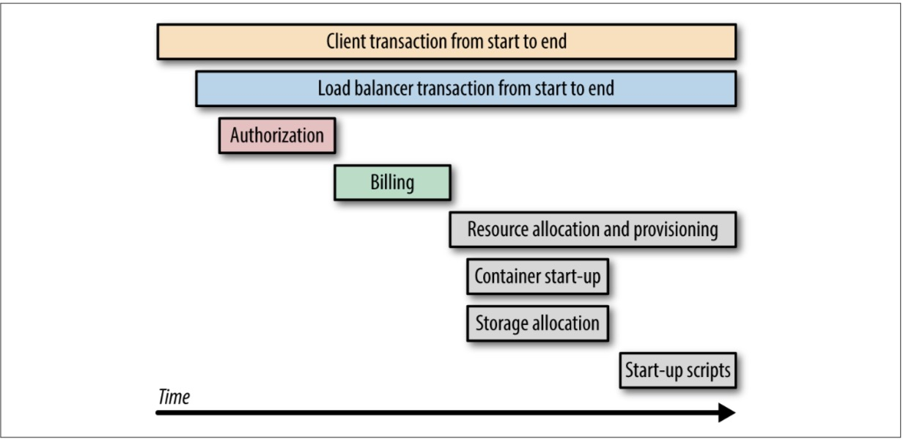

# 第7章 管理云原生应用程序

云原生应用程序旨在通过基础架构进行维护。正如我们在前面的章节中所展示的，云原生基础架构旨在由应用程序维护。

使用传统基础设施，大部分工作时间表，维护和升级应用程序都由人类完成。这可以包括在单个主机上手动运行服务或定义自动化工具中基础结构和应用程序的快照。

但是，如果基础架构可以由应用程序管理并同时管理应用程序，那么基础架构工具就会成为另一个应用程序。工程师对基础架构的责任可以用调解器模式表示，并内置到在该基础架构上运行的应用程序中。

我们刚刚花了前三章来解释我们如何构建可以管理基础架构的应用程序。本章将介绍如何在基础设施上运行这些应用程序或任何应用程序。

如前所述，保持基础架构和应用程序的简单性是非常重要的。管理应用程序复杂性的常用方法是将它们分解成小的，易于理解的组件。我们通常通过创建单一用途的服务来实现这一点，或者将代码分解为一系列事件触发的函数

即使是最自动化的基础设施，小型，可部署单元的扩散也可能令人沮丧。管理大量应用程序的唯一方法是让他们承担第1章中所述的功能性操作。应用程序需要在可以按比例管理之前变成原生云。

本章不会帮助您构建下一个伟大的应用程序，但它应该为您提供一些起点，让您的应用程序在云原生基础架构上运行时运行良好。

##应用程序设计

有很多书讨论如何构建应用程序。本书不打算成为其中之一。但是，了解应用程序体系结构如何影响有效的基础设施设计仍然很重要。

正如我们在第1章中所讨论的那样，我们将假设应用程序被设计为云原生，因为它们从云原生基础架构中获得最大收益。从根本上说，云原生意味着应用程序旨在由软件而不是人类来管理。

应用程序的设计与打包应用程序的设计是分开考虑的。应用程序可以是云原生，并且可以打包为RPM或DEB文件，并部署到虚拟机而不是容器。它们可以是单体或微型服务，用Java或Go编写。

这些实现细节不会使设计的应用程序在云中运行。

作为一个例子，让我们假装我们有一个用Go编写的应用程序，并打包在一个容器中。我们甚至可以说容器运行在Kubernetes上，并且无论您选择什么定义，都将被视为微服务。

这是假装的应用程序“云原生”？

如果应用程序将所有活动记录到文件并硬编码数据库IP地址，该怎么办？也许它不接受运行时配置并将状态存储在本地磁盘上。如果它不以可预见的方式存在，或者挂起并等待人工进行调试呢？

这个假装的应用程序可能会从所选择的语言和包装中出现原生云，但它绝对不是。像Kubernetes这样的框架可以通过各种功能来帮助管理这个应用程序，但即使您能够使其运行，该应用程序也被明确设计为由人类维护和运行。

第1章详细介绍了使应用程序在云原生基础架构上运行得更好的一些功能。如果我们具有第1章中规定的功能，应用程序还有另一个考虑因素：我们如何有效管理它们？

##实施云原生模式

诸如弹性，服务发现，配置，日志记录，运行状况检查和指标等模式都可以以不同方式在应用程序中实施。实现这些模式的常见做法是通过导入应用程序的标准语言库。 Netflix OSS和Twitter的Finagle是在Java语言库中实现这些功能的很好的例子。

当您使用库时，应用程序可以导入库，并且它会自动获得许多这些功能，而无需额外的代码。当一个组织内很少支持语言时，这种模式很有意义。它允许最佳实践是一件容易的事情。

当组织开始实施微服务时，他们往往倾向于使用多服务（polyglot）服务.3这样可以自由地为服务选择正确的语言，但是很难为所有语言维护库。

另一种获得这些特征的方法是通过所谓的“边车”模式。此模式将实施各种管理功能的应用程序捆绑在一起。它通常作为单独的容器来实现，但您也可以通过在VM上运行另一个守护进程来实现它。

sidecars的例子包括以下内容：

**特使代理**

为服务增加弹性和指标

**注册**

通过外部服务发现注册服务

**组态**

监视配置更改并通知服务进程重新加载

**健康终点**

提供用于检查应用程序运行状况的HTTP端点

Sidecar容器甚至可以用来适应polyglot容器，以暴露特定于语言的端点与使用库的应用程序进行交互。来自Netflix的Prana正是为那些不使用标准Java库的应用程序做的。

当集中的团队管理特定的边车过程时，边车模式很有意义。如果工程师想要在他们的服务中公开度量标准，他们可以将其构建到应用程序中 - 或者一个单独的团队也可以提供处理日志记录输出并公开计算出的度量值的边车。

在这两种情况下，服务都可以添加功能，而不必重写应用程序。一旦能够使用软件管理应用程序，我们来看看应该如何管理应用程序的生命周期。

##应用程序生命周期

云原生应用程序的生命周期与传统应用程序没有什么不同，除了它们的阶段应该由软件来管理。

本章不打算解释管理应用程序时涉及的所有模式和选项。我们将简要讨论几个阶段，这些阶段特别受益于在云原生基础架构之上运行云原生应用程序：部署，运行和退役。

这些主题并不都包含所有选项，但还有很多其他书籍和文章可供选择，这取决于应用程序的体系结构，语言和所选库。

###部署

部署是应用程序最依赖基础架构的一个领域。虽然没有什么能够阻止应用程序自行部署，但基础架构管理的其他方面仍然很多。

你如何进行整合和交付是我们在这里不会涉及的主题，但是这个领域的一些做法很明确。应用程序部署不仅仅是获取代码并运行它。

云原生应用程序旨在由软件在各个阶段进行管理。这包括正在进行的健康检查以及初始部署。应尽可能地消除技术，流程和策略中的人为瓶颈。

应用程序的部署应该是自动的，自助式的，并且如果处于积极的开发中，则是频繁的。他们也应该被测试，验证和平静。

一次替换应用程序的每个实例很少是新版本和功能的解决方案。新功能在配置标志后面“选通”，可以在不重新启动应用程序的情况下选择性地动态启用。版本升级部分展开，通过测试进行验证，并在所有测试通过时以受控方式展开。

当启用新功能或部署新版本时，应该存在控制流向或离开应用程序的流量的机制（请参阅附录A）。这可以限制中断的影响，并允许缓慢的部署和更快的反馈循环来实现应用程序性能和功能的使用。

基础架构应负责部署软件的所有细节。工程师可以定义应用程序版本，基础架构要求和依赖关系，并且基础架构将朝着该状态发展，直至满足所有要求或需求更改。

### 运行

运行应用程序应该是应用程序生命周期中最平稳最稳定的阶段。运行软件的两个最重要的方面在第1章中讨论：了解应用程序在做什么以及可以根据需要更改应用程序的可操作性。

我们已经在第1章中详细介绍了报告健康和遥测数据的应用程序可观察性，但是当事情不按预期工作时，您会做什么？如果应用程序的遥测数据显示它不符合SLO，那么如何解决和调试应用程序？

对于云原生应用程序，您不应该通过SSH连接到服务器并查看日志。如果您需要SSH，日志文件或服务器，甚至可能值得考虑。

您仍然需要应用程序访问（API），日志数据（云日志记录）以及堆栈中某个位置的服务器，但值得通过练习来查看是否需要传统工具。当事情中断时，您需要调试应用程序和基础架构组件的方法。

在调试一个破损的系统时，您应该首先查看您的基础架构测试，如第5章所述。测试应公开所有未正确配置或未提供预期性能的基础架构组件。

仅仅因为你不管理底层基础设施并不意味着基础设施不能成为你问题的原因。通过测试来验证期望值将确保您的基础架构能够以您期望的方式执行。

在排除基础设施后，您应该查看应用程序以获取更多信息。转向应用程序调试的最佳位置是应用程序性能管理（APM）以及可能通过OpenTracing等标准进行的分布式应用程序跟踪。

OpenTracing示例，实现和APM不在本书的范围之内。作为非常简短的概述，OpenTracing允许您在整个应用程序中跟踪调用，以更轻松地识别网络和应用程序通信问题。 OpenTracing的示例可视化可以在图7-1中看到。 APM为您的应用程序添加了用于向收集服务报告指标和故障的工具。

图7-1. OpenTracing可视化

当测试和跟踪仍然没有公开问题时，有时您只需要在应用程序上启用更详细的日志记录。但是，如何在不破坏问题的情况下启用调试？

运行时配置对于应用程序很重要，但在云原生环境中，配置应该是动态的，无需重新启动应用程序。配置选项仍然通过应用程序中的库实现，但标志值应该能够通过集中协调器，应用程序API调用，HTTP标头或多种方式进行动态更改。

Netflix的Archaius和Facebook的Gate-Keeper是动态配置的两个例子。前Facebook工程经理贾斯汀米切尔在Quora的帖子中分享到：

> [Gatekeeper]从代码部署中解耦功能释放。我们可以在几天或几周内发布功能，因为我们观看了用户指标，性能并确保服务可以随时扩展。

允许对应用程序配置进行动态控制，可以实现更多控制曝光过度的功能并更好地测试已部署代码的覆盖范围仅仅因为推新代码很容易并不意味着它是适合所有情况的正确解决方案。

基础架构可以帮助解决此问题，并通过协调何时启用功能和基于高级网络策略路由流量来启用更灵活的应用程序。这种模式还允许更细粒度的控制和更好的协调推出或回滚场景。

在动态的自助服务环境中，将部署的应用程序数量将快速增长。您需要确保您有一个简单的方法来动态调试类似自助服务模型中的应用程序以部署应用程序。

与工程师喜欢推新应用程序一样，反过来很难让他们退休旧应用程序。即使如此，它仍然是应用程序生命周期中的关键阶段。

###退休

部署新的应用程序和服务在快速移动的环境中很常见。即时应用程序应该像创建它们一样自助服务。

如果自动部署和监控新服务和资源，则应该按照相同标准退役。尽快部署新服务而不删除未使用的服务是应对技术债务的最简单方法。

识别应该退役的服务和资源是特定业务的。您可以使用应用程序遥测测量的经验数据来了解是否正在使用某个应用程序，但是应退出应用程序的决定应由该业务制定。

基础架构组件（例如，VM实例和负载平衡器端点）应在不需要时自动清理。自动化组件清理的一个例子是Netflix的Janitor Monkey。该公司在一篇博文中解释道：

>看门人猴子通过在其上应用一组规则来确定资源是否应该成为清理候选人。如果任何规则确定该资源是清理候选人，则Janitor Monkey标记该资源并安排清理时间。

所有这些应用阶段的目标是让基础架构和软件管理传统上由人类管理的方面。我们不是编写自动化脚本，而是编写一次由人类运行的脚本，我们采用协调模式与组件元数据相结合的方式，不断运行并根据当前上下文对需要采取的高层次操作做出决策。

应用程序生命周期阶段不是应用程序依赖基础架构的唯一方面。还有一些基础服务，每个阶段的应用程序都依赖于基础设施。我们将在下一节讨论应用程序中提供的一些支持服务和API基础结构。

##基础设施的应用要求

云原生应用程序对基础架构的期望远远超过只执行二进制文件他们需要抽象，隔离和保证他们如何运行和管理。作为回报，他们被要求提供钩子和API以允许基础设施管理它们。要成功，就需要有一种共生关系。

我们在第1章中定义了云原生应用程序，并刚刚讨论了一些生命周期要求。现在让我们看看他们从运行它们的基础架构中获得的更多期望：

 - 运行时间和隔离
 - 资源分配和调度
 - 环境隔离
 - 服务发现
 - 状态管理
 - 监测和记录
 - 度量聚合
 - 调试和跟踪

所有这些都应该是服务的默认选项，或者是自助API提供的。我们将更详细地解释每个要求，以确保明确定义期望。

###应用程序运行时和隔离

传统应用程序只需要一个内核并可能需要一个解释器来运行.Cloud本机应用程序仍然需要它，但它们也需要与运行的操作系统和其他应用程序隔离。隔离使多个应用程序能够在同一台服务器上运行并控制它们的依赖关系和资源。

应用程序隔离有时称为多租户。该术语可用于在同一服务器上运行的多个应用程序以及在共享集群中运行应用程序的多个用户。用户可以运行经过验证的可信代码，也可以运行您无法控制且不信任的代码。

要成为本地云，不需要使用容器。 Netflix率先推出了许多云原生模式，当公司过渡到在公共云上运行时，它使用虚拟机作为其部署工件，而不是容器。 FaaS服务（例如AWS Lambda）是用于打包和部署代码的另一种流行的云原生技术。在大多数情况下，他们使用容器进行应用程序隔离，但容器包装对用户是隐藏的。

> **什么是容器？**
>
>容器有很多不同的实现。 Docker推广术语容器来描述在孤立环境中打包和运行应用程序的方式。基本上，容器使用内核原语或硬件功能来隔离单个操作系统上的进程。
>
>容器隔离级别可能会有所不同，但通常这意味着应用程序使用独立的根文件系统，名称空间以及来自同一服务器上其他进程的资源分配（例如，CPU和RAM）运行。容器格式已被许多项目采用，并创建了开放容器计划（OCI），该计划定义了如何打包和运行应用程序容器的标准。

隔离还会给编写应用程序的工程师造成负担。他们现在负责声明所有的软件依赖关系。如果他们不这样做，应用程序将无法运行，因为必要的库将不可用。

容器经常被选择用于云原生应用程序，因为已经出现了用于管理它们的更好的工具，流程和编排工具。虽然容器是实现运行时和资源隔离的最简单方式，但这并不总是（并且可能不会）如此。

###资源分配和调度

从历史上看，应用程序可以提供有关最低系统要求的粗略估计，人类有责任确定应用程序可以运行的位置.4人工调度可能需要很长时间才能准备应用程序运行的操作系统和依赖项。

部署可以通过配置管理和配置实现自动化，但仍然需要人员验证资源并标记服务器以运行应用程序。云原生基础架构依赖于依赖关系隔离，并允许应用程序在资源可用的任何地方运行。

通过隔离，只要系统具有可用的处理，存储和访问依赖性，应用程序就可以在任何地方进行调度。动态调度消除了更好地将决策留给机器的人为瓶颈。集群调度程序从所有系统收集资源信息并找出运行应用程序的最佳位置。

>让人类安排申请安置不会扩大规模。人类生病，休假（或至少他们应该），并且通常是瓶颈。随着规模和复杂性的增加，人们也不可能记住应用程序在哪里运行。
>
>许多公司试图通过招聘更多人来扩大规模。这加剧了这个问题，因为调度需要在多个人之间进行协调。最终，人类调度将采用电子表格（或类似的解决方案）来保存每个应用程序的运行位置。

动态调度并不意味着操作员无法控制。基于调度器可能没有的知识，操作员仍然可以覆盖或强制进行调度决策。覆盖和手动资源调度应通过API提供，而不是会议请求。

解决这些问题是Google编写名为Borg的内部集群调度程序的主要原因之一。在博格的研究报告中，谷歌指出：

Borg提供了三大好处：（1）隐藏了资源管理和失败处理的细节，因此用户可以专注于应用程序开发; （2）以非常高的可靠性和可用性运行，并支持相同的应用程序;和（3）让我们可以有效地在数以万计的机器上运行工作负载。

调度程序在任何云原生环境中的角色都非常相似。从根本上说，它需要抽象出许多机器并允许用户请求资源，而不是服务器。

###环境隔离

当应用程序由许多服务组成时，基础结构需要提供一种方法来定义与所有依赖关系的隔离。传统上，通过将服务器，网络或群集复制到开发或测试环境来管理依赖关系。基础架构应能够通过应用程序环境在逻辑上分离依赖关系，而不会发生完全集群重复。

逻辑分割环境允许更好地利用硬件，减少重复的自动化，并且更容易测试应用程序。在某些情况下，需要单独的测试环境（例如，需要进行低级别更改时）。但是，应用程序测试不是应该要求完整的重复基础架构的情况。

环境可以是传统的永久性开发，测试，阶段和生产，也可以是动态分支或基于提交的。它们甚至可以是生产环境的一部分，通过动态配置和实例选择性路由启用功能。

环境应由应用程序所需的所有数据，服务和网络资源组成。这包括诸如数据库，文件共享和任何外部服务之类的东西。云原生基础架构可以创建开销非常低的环境。

基础设施应该能够提供环境，但它被使用。应用程序应遵循最佳实践，允许灵活配置以支持环境，并通过服务发现发现支持服务的端点。

###服务发现

应用程序几乎可以肯定依靠一项或多项服务来提供商业利益。基础设施的责任是提供一种服务在每个环境基础上找到彼此的方式。

某些服务发现需要应用程序进行API调用，而其他服务则通过DNS或网络代理透明地进行。使用什么工具并不重要，但服务使用服务发现很重要。

尽管服务发现是最古老的网络服务之一（即ARP和DNS），但它经常被忽视并且未被利用。在每个实例文本文件或代码中静态定义服务端点不可扩展，并且不适合云原生环境。端点注册应该在创建服务时自动发生，并且端点可用或消失。

云原生应用程序与基础架构一起工作以发现其相关服务。这些包括但不限于DNS，云元数据服务或独立服务发现工具（即etcd和consul）。

###状态管理

状态管理是基础架构如何知道应用程序实例需要做什么，如果有的话。这与应用程序生命周期截然不同，因为生命周期适用于整个开发过程中的应用程序。状态适用于启动和停止的实例。

应用程序有责任提供API或钩子，以便检查其当前状态。基础设施的责任是监视实例的当前状态并采取相应的行动。

以下是一些应用程序状态：

 - 已提交
 - 预定
 - 准备好了
- 健康
 - 不健康
 - 终止

各州和相应行动的简要概述如下：

1.申请提交运行。
2.基础设施检查请求的资源并安排应用程序。
当应用程序启动时，它将提供一个准备好/未准备好的状态。
3.基础架构将等待就绪状态，然后允许使用应用程序资源（例如，将实例添加到负载平衡器）。
如果应用程序在指定的超时之前未准备好，基础结构将终止它并安排新的应用程序实例。
4.应用程序准备就绪后，基础架构将监视活动状态并等待不健康状态，或者直到应用程序设置为不再运行。

比列出的国家还多。如果要对国家进行正确的检查和采取行动，各国需要得到基础设施的支持。 Kubernetes通过事件，探测和挂钩实现应用程序状态管理，但是每个编排平台都应该具有类似的应用程序管理功能。

当应用程序被提交，计划或缩放时，触发Kubernetes事件。探测器用于检查应用程序何时准备好提供流量（准备就绪）并确保应用程序健康（活跃）。挂钩用于在进程启动之前或之后需要发生的事件。

应用程序实例的状态与应用程序生命周期管理同样重要。基础架构在确保实例可用并据此采取行动方面起着关键作用。

###监控和记录

应用程序不应该要求被监视或记录;他们是基础设施运行的基本假设。更重要的是，如果需要，用于监视和日志记录的配置应该以与应用程序资源请求相同的方式声明为代码。如果您拥有部署应用程序的所有自动化功能，但无法动态监视服务，则仍有待完成。

状态管理（即进程健康检查）和日志记录处理应用程序的各个实例。日志系统应该能够根据应用程序，环境，标签或任何其他有用的元数据整合日志。

应用程序应该尽可能没有单点故障，并且应该运行多个实例。如果应用程序有100个实例正在运行，则如果单个实例变得不健康，则监控系统不应触发警报。

监视从整体上看应用程序，并用于调试和验证所需的状态.5监视与警报不同，因为应根据应用程序的度量和SLO触发警报。

###度量聚合

要知道应用程序处于健康状态时的行为方式，他们还需要指标。他们还可以提供有关不健康时可能被破坏的信息的洞察 - 并且就像监视一样，收集的度量应作为代码作为应用程序定义的一部分被请求。

基础架构可以自动收集有关资源利用率的指标6，但应用程序有责任呈现服务级别指标的指标。

虽然监测和日志记录是应用程序运行状况检查，但指标可提供所需的遥测数据。没有指标，就无法知道应用程序是否满足服务级别目标以提供业务价值。

>从日志中提取遥测和健康检查数据可能很诱人，但要小心，因为日志记录需要后处理，并且比特定于应用的度量标准端点需要更多开销。
>
>在收集指标时，您希望尽可能接近实时数据。这需要一个可以扩展的简单且低开销的解决方案。
>
>应该使用日志进行调试，并且应该预计数据处理的延迟。

与日志记录类似，度量标准通常在实例级收集，然后汇总在一起以提供完整服务的视图，而不是单个实例。

一旦应用程序提供收集度量标准的方法，基础架构的工作就是分析，整合和存储度量标准。收集指标的端点应该可以根据每个应用程序进行配置，但数据格式应该标准化，以便可以在单个系统中查看所有指标。

###调试和跟踪

应用程序在开发过程中很容易调试。集成开发环境（IDE），代码断点以及在调试模式下运行都是工程师在编写代码时可以使用的所有工具。

对于部署的应用程序来说，内省要困难得多。当应用程序由数十或数百个微服务或独立部署的功能组成时，此问题更为严重。当用多种语言和不同的团队编写服务时，也可能无法将工具内置到应用程序中。

基础架构需要提供调试整个应用程序的方法，而不仅仅是单个服务。调试有时可以通过日志记录系统完成，但是复制错误需要较短的反馈循环。

如前所述，调试是动态配置的一个很好的使用。当发现问题时，应用程序可以切换到详细日志记录，而无需重新启动，并且流量可以通过应用程序代理有选择地路由到实例。

如果问题无法通过日志输出解决，那么分布式跟踪提供了一个不同的界面来可视化发生的事情。分布式跟踪系统（如OpenTracing）可以补充日志以帮助人类调试问题。

跟踪为调试分布式系统提供了更短的反馈回路。如果它不能构建到应用程序中，则可以通过代理或流量分析由基础结构透明地完成。当您大规模地运行任何协调的应用程序时，基础结构提供了一种调试应用程序的方法。

尽管在分布式系统中设置跟踪有很多好处和实现细节，但我们不会在此讨论。应用程序跟踪一直非常重要，在分布式系统中越来越困难。云原生基础架构需要提供可以透明方式跨越多个服务的跟踪。

##结论

应用程序需求已经改变：带有操作系统和软件包管理器的服务器已经不够用了。应用程序现在需要协调服务和更高级别的抽象。抽象允许资源与服务器分离并根据需要以编程方式使用。

本章中提出的要求并不是基础架构可以提供的所有服务，但它们是云原生应用程序所期望的基础。如果基础设施不提供这些服务，那么应用程序将不得不实施它们，否则它们将无法达到现代业务所需的规模和速度。

基础设施不会自行发展;人们需要改变他们的行为，并从根本上想到以不同的方式运行应用程序需要做的事情。幸运的是，有些项目建立在开创这些解决方案的公司的经验之上。

应用程序依赖基础架构的功能和服务来支持敏捷开发。基础架构要求应用程序公开端点和集成以自主管理。工程师应尽可能使用现有的工具，并设计出有弹性的简单解决方案。
